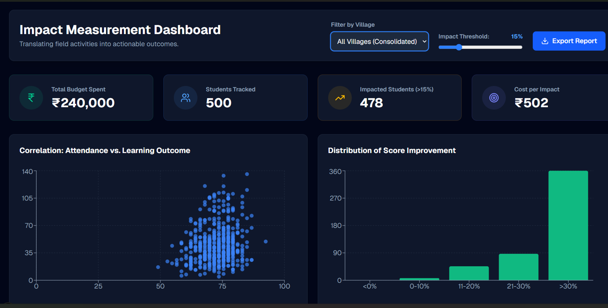

<div align="center">

# Impact Measurement Dashboard

### *Turning NGO Field Data into Leadership-Ready Insights*

---


**Challenge 5.1 — Impact Measurement Dashboard for a Partner NGO**
`Analytics & Insights Track`

</div>

---

## Preview




---

## Highlights at a Glance

| Feature | Description |
|--------|-------------|
| 🎯 Executive KPI | Cost-per-Impacted Student |
| 📈 Tracking | Real-time Outcome Monitoring |
| 🌳 Framework | Theory of Change Based KPIs |
| 🧠 Analysis | Dynamic Impact Threshold Engine |
| 🌍 Insights | Geographic & Demographic Breakdown |
| 📄 Reporting | One-Click CSR/Donor Report Generation |
| 🔍 Quality | Automated Data Validation Pipeline |
| ⚡ Performance | Dashboard Load Time Under 3 Seconds |

---

## Table of Contents

1. [The Problem](#the-problem)
2. [Our Solution](#our-solution)
3. [Theory of Change](#theory-of-change)
4. [Challenge Questions](#challenge-questions)
5. [Core Features](#core-features)
6. [System Architecture](#system-architecture)
7. [Project Structure](#project-structure)
8. [Data Pipeline](#data-pipeline)
9. [Getting Started](#getting-started)
10. [Success Metrics](#success-metrics)
11. [Future Roadmap](#future-roadmap)
12. [Team](#team)

---

## The Problem

Most NGOs measure activity — not impact.

They track:
- Number of workshops conducted
- Number of beneficiaries reached
- Number of volunteers engaged

But none of these answer the only question that matters:

> **"Are we actually creating measurable change in people's lives?"**

This gap costs NGOs in every direction — fundraising, program evaluation, donor reporting, strategic decisions, and resource allocation. Without outcome-focused measurement, it's impossible to know which interventions actually work.

---

## Our Solution

The Impact Measurement Dashboard bridges field operations and leadership decision-making by converting raw program data into actionable intelligence.

```
Activities  →  Outputs  →  Outcomes  →  Impact
```

The platform automatically processes:

- Attendance Records
- Assessment Scores
- Financial Expenses
- Beneficiary Demographics

...and transforms them into leadership-ready KPIs through an intuitive interface designed for non-technical NGO stakeholders.

---

## Theory of Change

The dashboard is built around a structured four-stage impact framework:

```
┌─────────────────────────────────────────────────┐
│  ACTIVITY (Input)                               │
│  Allocate resources & conduct programs          │
│  → Program Budget                               │
│  → Learning Hours Delivered                     │
│  → Sessions Conducted                           │
└────────────────────┬────────────────────────────┘
                     ↓
┌─────────────────────────────────────────────────┐
│  OUTPUT (Participation)                         │
│  Students actively engage in programs           │
│  → Attendance Rate                              │
│  → Session Participation Rate                   │
│  → Student Retention                            │
└────────────────────┬────────────────────────────┘
                     ↓
┌─────────────────────────────────────────────────┐
│  OUTCOME (Learning Improvement)                 │
│  Students demonstrate measurable learning gains │
│  → Baseline vs Endline Improvement              │
│  → Percentage Improvement                       │
│  → Learning Achievement Rate                    │
└────────────────────┬────────────────────────────┘
                     ↓
┌─────────────────────────────────────────────────┐
│  IMPACT (Mission Achievement)                   │
│  Efficiently improve outcomes at scale          │
│  → Cost-per-Impacted Student                    │
│  → Program Effectiveness Index                  │
│  → Overall Impact Score                         │
└─────────────────────────────────────────────────┘
```

---

## Challenge Questions

### Q1 — What's the one number the Executive Director checks every Monday?

**→ Cost-per-Impacted Student**

```
Cost-per-Impacted Student = Total Program Cost ÷ Number of Impacted Students
```

This single metric combines program effectiveness, financial efficiency, and outcome achievement into one decision-making signal — making it the clearest indicator of whether resources are being well spent.

---

### Q2 — How do we handle data quality issues?

The pipeline handles everything automatically before data reaches the dashboard:

- Duplicate removal
- Beneficiary record validation
- Missing value handling
- Format standardization
- Attendance record normalization
- Consistent dataset merging

---

### Q3 — What reporting cadence is right for each stakeholder?

| Stakeholder | Cadence | Reason |
|-------------|---------|--------|
| Field Workers | Weekly | Operational feedback loop |
| Program Managers | Weekly | Resource & attendance tracking |
| Executive Director | Monthly | Reliable trend analysis |
| Board Members | Quarterly | Strategic impact review |

---

## Core Features

**Executive Dashboard**
Track organization-wide impact through Cost-per-Impact, Total Beneficiaries, Program Performance, and Budget Utilization — all in one view.

**Dynamic KPI Engine**
Real-time KPI calculations from attendance, assessments, and expenses data. Includes adjustable impact threshold controls for scenario analysis.

**Geographic Analytics**
Compare impact across villages, districts, and regions using scatter charts, bar charts, and comparative visualizations.

**Demographic Insights**
Analyze outcomes by gender, age group, and village. Identify underserved communities and spot intervention opportunities early.

**CSR Reporting Engine**
Generate professional, print-ready reports for donors, CSR partners, board meetings, and funding applications in one click.

**Dark Mode Interface**
Built specifically for NGO staff, program managers, and leadership teams — clean, accessible, and easy on the eyes during long sessions.

---

## System Architecture

```
Raw NGO Data
(Attendance · Assessments · Expenses)
          │
          ▼
  Python ETL Pipeline
  (Clean · Validate · Transform)
          │
          ▼
  Cleaned Analytics Dataset
  (final_dashboard_data.csv)
          │
          ▼
      KPI Engine
  (Cost, Effectiveness, Impact Score)
          │
          ▼
  Interactive Dashboard
  (Next.js · React · Tailwind)
          │
          ▼
  Executive Decision Making
```

---

## Project Structure

```
impact-dashboard/
│
├── scripts/
│   ├── generate_data.py        # Synthetic dataset generation
│   ├── transform_data.py       # ETL & KPI computation
│   ├── page.tsx                # Main dashboard page
│   ├── layout.tsx              # App layout
│   ├── globals.css             # Global styles
│   ├── next.config.ts          # Next.js configuration
│   ├── package.json            # Dependencies
│   ├── package-lock.json
│   ├── eslint.config.mjs
│   ├── favicon.ico
│   ├── image.png               # Dashboard screenshots
│   ├── image-1.png
│   └── *.svg                   # Icons (file, globe, next, vercel, window)
│
├── Final.csv                   # Processed analytics output
├── assessments.csv             # Raw assessment records
├── attendance.csv              # Raw attendance logs
├── beneficiaries.csv           # Beneficiary demographic data
├── expenses.csv                # Program financial records
└── README.md
```

---

## Data Pipeline

### Step 1 — Data Generation (`generate_data.py`)

Produces realistic synthetic NGO datasets:
- 500 Students across 4 Villages
- 6-Month Program Duration
- Attendance Logs, Assessment Scores, Financial Records

### Step 2 — Data Transformation (`transform_data.py`)

Computes all KPIs from raw records:
- Attendance Rate
- Score Improvement (Baseline → Endline)
- Impact Metrics
- Program Costs per Student

Output: `Final.csv` — a flattened, dashboard-optimized dataset

---

## Getting Started

**Prerequisites:** Node.js 18+ and Python 3.9+

```bash
# Clone the repo
git clone <your-repository-url>
cd impact-dashboard

# Install frontend dependencies
npm install

# Start development server
npm run dev
```

Open `http://localhost:3000` in your browser.

**To regenerate the dataset (optional):**

```bash
cd scripts

# Create and activate virtual environment
python -m venv venv
source venv/bin/activate        # Linux/macOS
# venv\Scripts\activate         # Windows

pip install pandas numpy

python generate_data.py
python transform_data.py
```

---

## Success Metrics

| Metric | Target |
|--------|--------|
| Dashboard Load Time | < 3 seconds |
| KPI Accuracy | 100% |
| Data Validation | Fully Automated |
| Stakeholder Usability Score | ≥ 8 / 10 |
| Dashboard Refresh | Near Real-Time |

---

## Future Roadmap

**Database Migration**
Transition from flat CSV architecture to PostgreSQL / Supabase for scalable, queryable storage.

**Role-Based Access Control**
- Field Workers → Attendance entry, assessment submission
- Program Managers → Performance monitoring, resource allocation
- Executive Directors → Impact monitoring, strategic planning

**AI-Powered Insights**
Auto-generated weekly summaries, trend analysis, performance alerts, and intervention recommendations.

**IRIS+ Framework Integration**
Align all outcomes with globally recognized impact measurement standards — improving donor reporting, grant applications, and organizational transparency.

---

## Expected Impact

This project delivers a reusable impact measurement framework adaptable across NGO sizes and sectors.

Organizations adopting this dashboard gain better funding decisions, improved program effectiveness, stronger donor confidence, data-driven leadership, and a scalable foundation for long-term impact measurement.

---

## Team

| Name | Branch | Contribution |
|------|--------|-------------|
| Rishi Chaudhary | Mechanical Engineering | Data Engineering & Dashboard Development |
| Ashish Kumar | Mechanical Engineering | Analytics, Frontend & Impact Design |

---

<div align="center">

*Built for Challenge 5.1 — Impact Measurement Dashboard for a Partner NGO*
`Analytics & Insights Track`

</div>
